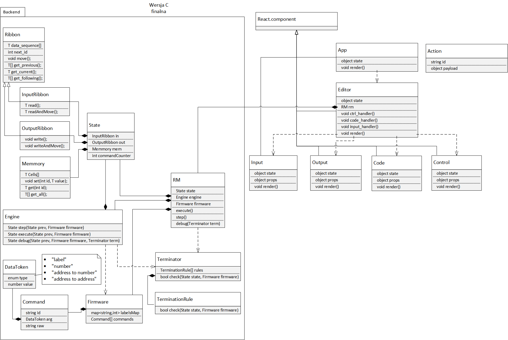
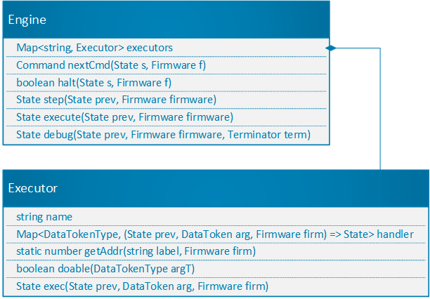
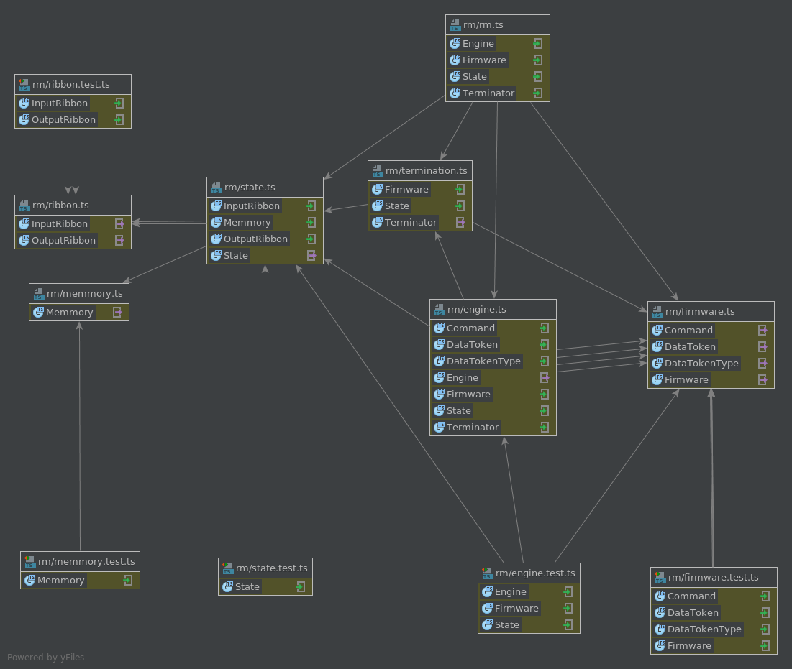

# RMR 2

## About RAM Machine React - introduction

RMR 2 is a project created by Łukasz Kleczaj during "Programowanie Obiektowe" class.

It's primary goal is enabling sudents to test and develop code for RAM Machine on any platform they may desire to use. 
To achieve just that I've decided to run entire thing in a Web Browser.

I've used ES2018 component - Regex Lookbehind so for RMR2 is GoogleChrome only.

## Architecture

Core of the project is a RM interpreter written in TypeScript, 
usage of TypeScript allowed me to use many futures that does not exist in plain JS or are not supported by any browser yet, 
like types or imports.

Around RM core there is a UI written in TSX with react. 
React allows me to achieve easy to understand modular design with no compromises on extendability while taking care of rendering performance (to some degree of course).

### RM architecture and implementation

##### RM <=> React.js UI

React.js UI wraps Ram Machine class instance. 

##### RM consists of following classes
* Ribbon - abstract class for RibbonIn and RibbonOut to inherit from
* Terminator
    * TerminationRule[] - for specific rules to inherit from
* TerminationAtLine extends TerminationRule
    * lineNumber
* RM - wrapper for entire machine
    * State - wrapper for entire mutable part of machine state
        * RibbonIn - input ribbon
        * RibbonOut - output ribbon
        * Memmory
        * InstructionCounter
    * Firmware - wrapper for immutable part of machine state
        * Command[]
            * id
            * arg
                * type
                * value
    * Engine 
        * Map <cmdID, Executor> - object responsible for executing a command

##### classes dependencies and relationships

##### internal structure of the Engine

##### filesystem structure and dependencies between files



#### Ribbon

An abstract class responsible for providing properties common for RibbonIn and RibbonOut.

* protected dataSequence: number[];
    * stores frames for payload in order 
* protected nextId: number;
    * stores id of next frame to be read from / written into
* move(): void
    * moves id to latter frame (by one) 
* getPrevious(): number[]
    * payloads form frames behind counter
    * useless for RM, to be used in UI
* getCurrent(): number
    * payload form frame corresponding to the counter
* getFollowing(): number[]
    * payloads form frames ahead of counter
    * useless for RM, to be used in UI
* getEntire(): number[]
    * all the payloads in order

#### InputRibbon (extends Ribbon)

Class responsible for storing and processing RM's Input Ribbon 

* read(): number
    * payload form frame corresponding to the counter
    * effectively alias for getCurrent()
* readAndMove(): number
    * executes read() and then move()

#### OutputRibbon (extends Ribbon)

Class responsible for storing and processing RM's Output Ribbon 

* write(val: number): void
    * sets payload in frame corresponding to the counter
* writeAndMove(val: number): void
    * executes write() and then move()

#### Memmory
* cells: number[]
* set(id: number, value: number): void
* get(id: number): number
* getAll(): number[]

#### State
* halted: boolean
* in: InputRibbon
* out: OutputRibbon
* mem: Memmory
* commandCounter: number

#### DataTokenType < Enumerable >
* NUMBER
* ADDRESS_TO_NUMBER
* ADDRESS_TO_ADDRESS
* LABEL
* NULL

#### DataToken
* static checks
    * NUMBER: /^=\d+$/
    * ADDRESS_TO_NUMBER: /^\d+$/
    * ADDRESS_TO_ADDRESS: /^\^\d+$/
    * LABEL: /^\.([a-z])\w*$/
* type: DataTokenType
* value: string | number | null

#### Command
* static checks
    * valid: /(([a-z])+:\s)?([A-Z])+(\s(\.([a-z])+|(([\^=])?\d+)))?/
    * label: /^([a-z])+(?=\:)/g
    * id: /[A-Z]+/g
    * argument: /\.([a-z])+|(([\^=])?\d+)/g
* raw: string
* label: string | null
* id: string
* arg: DataToken
* static validate_line(line: string): boolean

#### Firmware
* map: Map<string, number>
* commands: Command[]
* text(): string 

#### Executor
* name: string
* handlers: Map<DataTokenType, (prev: State, arg: DataToken, firm: Firmware) => State>
* static getAddr(label: string, firm: Firmware): number
* doable(argT: DataTokenType): boolean
* exec(prev: State, arg: DataToken, firm: Firmware): State

#### Engine
* executors: Map<string, Executor>
* static nextCmd(s: State, f: Firmware): Command
* static halt(s: State, f: Firmware): boolean
* step(prev: State, firmware: Firmware): State
* execute(prev: State, firmware: Firmware): State
* debug(prev: State, firmware: Firmware, term: Terminator): State

#### RM
* engine: Engine
* firmware: Firmware
* state: State
* execute(): State
* debug(term: Terminator): State 
* step(): State

#### TerminationRule
* check(state: State, firmware: Firmware): boolean

#### TerminateAtLine extends TerminationRule
* nr: number
* check(state: State, firmware: Firmware): boolean

#### Terminator
* rules: TerminationRule[]
* addRule(r: TerminationRule): void 
* check(state: State, firmware: Firmware): boolean

## Shortcomings and mistakes

#### V8 (GoogleChrome/ChromiumBrowser) only
Unfortunately usage of Regex Lookbehind limited RMR2 to GoogleChrome however I strongly believe that Mozilla's gecko engine will receive support very soon. 
It's worth it beacuse they make code much cleaner and also are being executed natively - rewriting in JS would decrease performance.


#### development require an unusual environment
* NodeJS v8.10+, v9.x+
* Yarn (npm replacement)
* very probably Linux OS

## Low hanging fruits for further development
* more fancy TerminationRule inheritance  

## Testing
Require:
* NodeJS v8.10+, v9.x+
* Yarn (npm replacement)
* very probably Linux OS


To perform tests execute from project root:
```
yarn
npm run test
``` 

## Building
Require:
* NodeJS v8.10+, v9.x+
* Yarn (npm replacement)
* very probably Linux OS


To build execute from project root:
```
yarn
npm run build
``` 

## Contribution guide

1. Test driven development for RM interpreter (RMI)
2. RMI logic shall never be merged with UI layer
3. All functions added to RMI should be covered with unit tests unless there is a good reason not to do so
4. tslint is the only source of truth about code quality requirements 


Copyright 2018 Łukasz Kleczaj

Permission is hereby granted, free of charge, to any person obtaining a copy of this software and associated documentation files (the "Software"), to deal in the Software without restriction, including without limitation the rights to use, copy, modify, merge, publish, distribute, sublicense, and/or sell copies of the Software, and to permit persons to whom the Software is furnished to do so, subject to the following conditions:

The above copyright notice and this permission notice shall be included in all copies or substantial portions of the Software.

THE SOFTWARE IS PROVIDED "AS IS", WITHOUT WARRANTY OF ANY KIND, EXPRESS OR IMPLIED, INCLUDING BUT NOT LIMITED TO THE WARRANTIES OF MERCHANTABILITY, FITNESS FOR A PARTICULAR PURPOSE AND NONINFRINGEMENT. IN NO EVENT SHALL THE AUTHORS OR COPYRIGHT HOLDERS BE LIABLE FOR ANY CLAIM, DAMAGES OR OTHER LIABILITY, WHETHER IN AN ACTION OF CONTRACT, TORT OR OTHERWISE, ARISING FROM, OUT OF OR IN CONNECTION WITH THE SOFTWARE OR THE USE OR OTHER DEALINGS IN THE SOFTWARE.